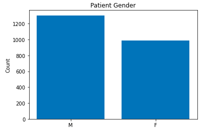
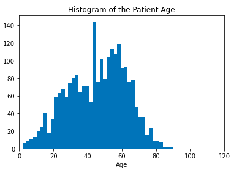
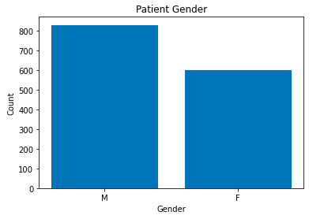
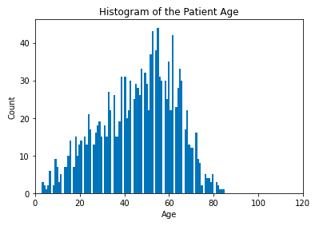

# Pneumonia Detection From Chest X-Rays

In this project we create a Pneumonia Assistant Classifier for assisting the radiologist into Pneumonia detection on chest x-rays to use in  chest x-rays screenings studies, in women and men with ages between 10 and 78 years.
We use the VGG16 CNN with all its layers freezed with the exception of the last convolutional layers on which we did fine tunning with loss='binary_crossentropy', optimizer='adam' and metrics=['binary_accuracy']. We also ad a flatten layer and the output dense layer.

**Clinical Impact of Performance:**

Since the algorithm is designed for screening studies we set our threshold in function of maximizing the recall. This is due to the  FP doesn’t have a bit impact on a patient and we are more interested in reduce the FN.

**Description of Training Dataset:**

 We have 2290 rows in our training dataset with 27 features. The pneumonia_class is balanced with 50 percent of the data of patients with pneumonia. The gender in slightly imbalanced as we can see as follows, with more males than females:

 

 The distribution of the ages is as follows with more cases between 10 and 78 years:

 

**Description of Validation Dataset:**

We have 1430 rows in our training dataset with 27 features. The pneumonia_class is imbalanced with 80 percent of the data of patients with pneumonia. The gender in slightly imbalanced as we can see as follows, with more males than females:

The distribution of the ages is as follows with more cases between 10 and 78 years:

###  Ground Truth

 We used the NIH Chest X-ray Dataset, this dataset is highly imbalanced in relation with the patients with pneumonia. NLP-derived labels from the NIH are sub-optimal since they are more general than only the case of Pneumonia, one patient can have more than one disease similar to Pneumonia and many of the with more prevalence in the dataset than Pneumonia. This could impact the algorithm clinical performance.

### FDA Validation Plan

**Patient Population Description for FDA Validation Dataset:**

 We want to make sure that the population used for the dataset are women and men with ages between 10 and 78 years with no history of previous Pneumonia disease. We also want an image type of "DX" and the only body part examined is the chest
 imaging modality, body parts examined, age range, gender distribution, prevalence of pneumonia (and other diseases)

**Ground Truth Acquisition Methodology:**

As the Ground Truth we will use the silver standard approach of using several radiologists since identifying Pneumonia is difficult for radiologists.

**Algorithm Performance Standard:**

The performance Standard that we will use is the recall since our algorithm is used for screening studies. We want to achieve a recall of more than 0.7. The F1 score of our algorithm was 0.417, this score is above the average of radiologists 0.387 [see this reference](https://arxiv.org/pdf/1711.05225.pdf).
